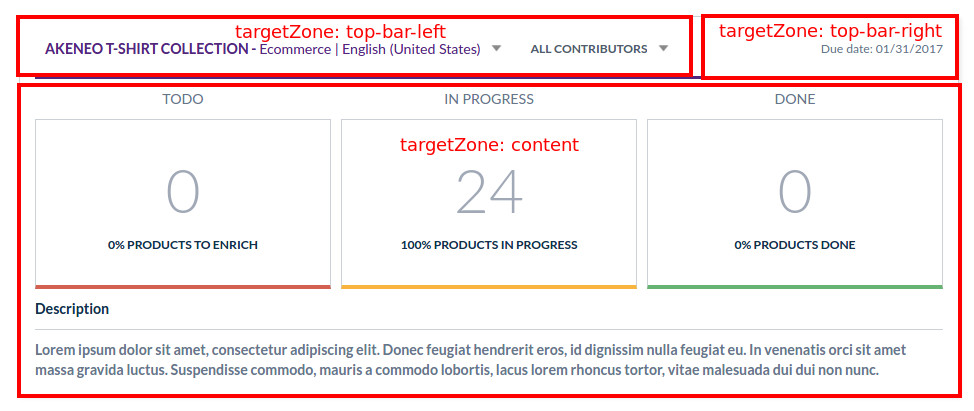

Completeness Widget
===================

Overview
________

With the Activity Manager feature comes a widget in the dashboard. The goal of this widget is to display the
completeness for contributors and owner. Displayed data are contextual. That means that the completeness is not the same
for each contributor and for the owner. Contributor sees completeness in terms of their own permissions. The owner sees
the completeness of all the project perimeter.

.. _`project calculation`: project_completeness.html

.. tip::

    To know more about the completeness calculation, you can read `project calculation`_.

Widget extension points?
________________________

Target zones
++++++++++++

Unlike the others, the activity manager widget has been done with the Product Edit Form architecture, so that it is
more customizable and maintainable. That allowed us to create some extension points thanks to target zones.

You can see with this figure that the widget has three target zones to put your own extension. For example, here are the
declaration of selectors extensions:

.. code-block:: yaml

    # src/PimEnterprise/Bundle/ActivityManagerBundle/Resources/config/form_extensions/widget.yml
    extensions:
        activity-manager-widget-project-selector:
            module: activity-manager/widget/project-selector
            # Add your extension to the widget
            parent: activity-manager-widget
            # Then add your extension in the target zone you want in the widget
            targetZone: top-bar-left
            # Specify the position in the target zone
            position: 100

        activity-manager-widget-contributor-selector:
            module: activity-manager/widget/contributor-selector
            parent: activity-manager-widget
            targetZone: top-bar-left
            position: 200

Which position to choose?
 - To add your extension at the far left the position must be lower than 100.
 - To add your extension between the project selector and the contributor selector the position must be between 100 and 200.
 - To add your extension at the far right the position must be above 200.

.. _`how to customize the PEF`: ../../cookbook/ui_customization/add_a_custom_button_to_product_edit_form.html

.. tip::

    We did cookbook about `how to customize the PEF`_.

Events
++++++

The list of events used in the widget and their descriptions:

 - ``activity-manager:widget:contributor-selected`` is triggered when a user selects a user in the contributor selector. Parameter is the user code.
 - ``activity-manager:widget:project-selected`` is triggered when a user selects a project in the project selector. Parameter is the project code.

Form model
__________

The form model of the widget is structured like this:

.. code-block:: javascript

    {
        'currentContributorUsername': 'julia', // {String} Contributor username currently selected
        'currentContributor': {User}, // {Object} Contributor object currently selected
        'currentProjectCode': 'high-tech-collection-2017-mobile-en-us', // {String} Project code currently selected
        'currentProject': {Project}, // {Object} Project object currently selected
    }
